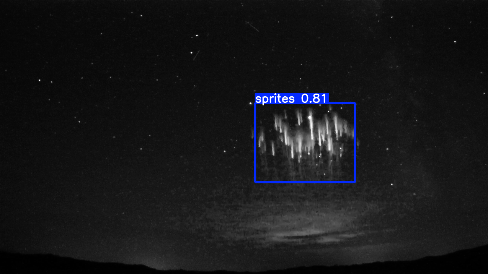

# SpriteNet

<a href="https://universe.roboflow.com/gmnsprites/spritenet">
    </img>
</a>

A machine learning model for object detection of sprites using the YOLOv5 model. The model is trained on images from the [Global Meteor Network](https://globalmeteornetwork.org/)'s camera and the dataset was annotated by hand.

